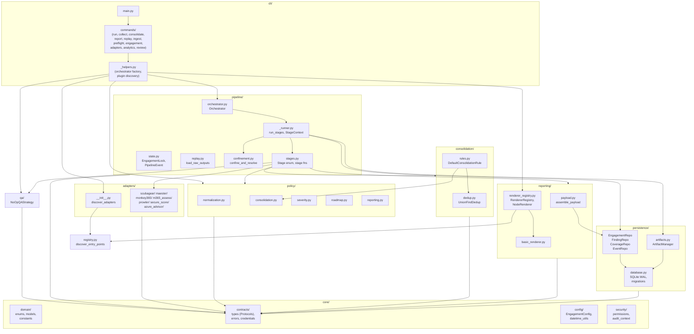
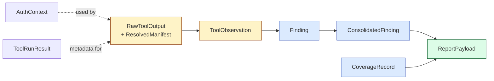
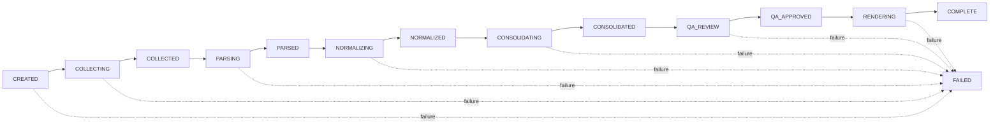

# Architecture Overview

GxAssessMS is a pipeline-oriented orchestrator for Microsoft 365 / Azure
assessment tools. It discovers tool adapters at startup, runs them in
parallel, parses and normalizes their output into a unified domain model,
deduplicates findings across tools, and renders a report.

This document describes the public framework: the layers, the data that flows
between them, and the Protocol-based extension points that let new tools,
renderers, policies, and QA strategies plug in without forking the package.

Detailed Protocol signatures live in [extension-points.md](extension-points.md).
Pipeline lifecycle, plugin discovery, and consolidation diagrams are in
[pipeline.md](pipeline.md) and [data-model.md](data-model.md).

## Layers

**Dependency direction.** `core/domain/` and `core/config/` have no imports
from other project packages; `core/contracts/` imports only from `domain/`
and `config/`; everything else builds on top. This is enforced by the
import-boundary convention tests
(`tests/conventions/test_import_boundaries.py`).

### What each layer does

- **`core/`** -- domain types, Protocols, errors, config, and security
  primitives. No I/O at import time. Defines the contract that the rest of
  the package, and any extension package, builds against.
- **`adapters/`** -- one package per tool (ScubaGear, Maester, Monkey365,
  M365-Assess, Prowler, Secure Score, Azure Advisor). Each implements the
  `ToolAdapter` Protocol with `adapter.py`, `parser.py`, `mappings.py`, plus
  fixtures. The registry under `adapters/__init__.py` discovers and validates
  them from entry points.
- **`pipeline/`** -- the orchestrator, stage functions, state machine,
  advisory locking, and the append-only event journal. Stages are pure
  functions that take inputs and return outputs; the orchestrator wires them
  together and persists results between stages.
- **`policy/`** -- judgment isolated from execution. Normalization, dedup
  reconciliation, severity overrides, roadmap phase assignment, and report
  suppression each live in their own module. Policy modules never do I/O;
  YAML rule data is loaded by `core/config/` and injected as plain dicts.
- **`consolidation/`** -- the union-find dedup engine and the default
  `ConsolidationRule` that bridges dedup grouping with the policy-driven
  merge step.
- **`persistence/`** -- SQLite with WAL mode plus per-engagement directories
  on disk. Repository classes are the only callers of SQL. Raw tool output
  lives on the filesystem; structured derivatives live in the DB.
- **`reporting/`** -- builds a `ReportPayload`, then hands it to one or more
  registered renderers. Renderers are Python wrappers over Node.js packages
  invoked via `NodeRenderer`.
- **`cli/`** -- Click-based commands. Each command is a thin wrapper: load
  config, build the orchestrator, call it. No business logic.
- **`qa/`** -- ships a `NoOpQAStrategy` that auto-advances `QA_REVIEW -> QA_APPROVED`.
  Replacement strategies register through the `gxassessms.qa_strategies`
  entry-point group.
- **`registry.py`** -- generic entry-point discovery. The adapter registry
  (`adapters/__init__.py`) and renderer registry
  (`reporting/renderer_registry.py`) both build on it.

## Extension Points

Every customization seam in the framework is a Protocol declared in
[`core/contracts/types.py`](../src/gxassessms/core/contracts/types.py) or, for
credentials, [`core/contracts/credentials.py`](../src/gxassessms/core/contracts/credentials.py).
Implementations are discovered via `importlib.metadata` entry points.

| Protocol | Entry-point group | Default implementation |
|----------|-------------------|------------------------|
| `ToolAdapter` | `gxassessms.adapters` | Seven adapters in `gxassessms.adapters.*` |
| `IngestCapableAdapter` | `gxassessms.adapters` | Adapters declaring `"ingest"` capability |
| `ReportRenderer` | `gxassessms.renderers` | `BasicDocxRenderer` (`basic_docx`) |
| `QAStrategy` | `gxassessms.qa_strategies` | `NoOpQAStrategy` (`noop`) |
| `ConsolidationRule` | `gxassessms.consolidation_rules` | `DefaultConsolidationRule` (`default`) |
| `NormalizationPolicy` | `gxassessms.policies` (`normalization`) | `DefaultNormalizationPolicy` |
| `ConsolidationPolicy` | `gxassessms.policies` (`consolidation`) | `DefaultConsolidationPolicy` |
| `CredentialProvider` | `gxassessms.credentials` | `EnvVarProvider` (`env_var`) |

Additional optional groups -- `gxassessms.analytics`, `gxassessms.review_ui` --
are checked by the CLI; commands that depend on them print a clear message
when no implementation is registered (see
[cli-reference.md](cli-reference.md#mseco-analytics)).

See [extension-points.md](extension-points.md) for method signatures, return
shapes, and contract semantics.

## Data Model at a Glance

The full ER diagram is in [data-model.md](data-model.md). The short version:

Three explicit finding identities track different concerns:

- `observation_id` -- tool-native parse-level identity
  (`{tool}:{native_check_id}`), assigned by `parse()`
- `finding_key` -- normalized semantic identity for dedup and stable
  cross-assessment comparison (e.g., `cis:m365:5.2.2.1`), assigned by the
  normalization policy
- `finding_instance_id` -- engagement-specific UUID, assigned when a
  `ConsolidatedFinding` is created in the DB; never reused across engagements

## Pipeline Lifecycle

Valid transitions are defined as a frozen mapping in
[`core/domain/enums.py:113-152`](../src/gxassessms/core/domain/enums.py) and
enforced by `EngagementState.assert_can_transition_to()`. The orchestrator
records every transition as a `state_transition` event in the journal; stage
state is a materialized projection of the journal.

See [pipeline.md](pipeline.md) for the full orchestrator and stage-level
sequence diagrams.

## Concurrency and Resilience

- **Parallel collection.** `pipeline.stages.collect()` runs adapters in a
  `ThreadPoolExecutor` (size = `config.max_parallel or len(adapters)`).
  Failures are captured as `CollectionResult` with status `FAILED` or
  `TIMEOUT`; the pipeline continues with partial results.
  ([stages.py:76-158](../src/gxassessms/pipeline/stages.py))
- **Advisory locking.** The CLI and any external review interface share an
  `EngagementLock` backed by `filelock`
  (`<engagements_root>/.locks/<engagement_id>.lock`).
  Mutating operations acquire the lock; concurrent attempts raise
  `LockTimeoutError` after the configured timeout.
  ([state.py:109-170](../src/gxassessms/pipeline/state.py))
- **Crash recovery.** Stage transitions are persisted atomically as journal
  events. The orchestrator detects engagements left in a `*ING` state from a
  killed process and treats them as failed stages on the next run
  ([orchestrator.py:350-366](../src/gxassessms/pipeline/orchestrator.py)).

## Persistence

- **SQLite (WAL mode).** Schema lives in
  [`persistence/migrations/`](../src/gxassessms/persistence/migrations/); the
  current state is captured in `001_initial.sql`. Subsequent migrations are
  applied in order and tracked in `_schema_migrations`.
- **Repository pattern.** No layer outside `persistence/` writes SQL. Repos
  expose typed CRUD: `EngagementRepo`, `FindingRepo`, `CoverageRepo`,
  `EventRepo`.
- **Hybrid storage.** Raw tool output, generated reports, and JSON manifests
  live under the engagement directory; structured derivatives (findings,
  coverage, events, overrides) live in the DB. Defaults: `~/.gxassessms/`
  for the data root, overridable via `GXASSESSMS_DATA_DIR`; DB path
  overridable via `GXASSESSMS_DB_PATH`
  ([database.py:25-46](../src/gxassessms/persistence/database.py)).

## Security Boundary

This document is about structure; the threat model and operator checklist
live in [security.md](security.md). The architecturally relevant points:

- Adapter prerequisites are checked against a code-owned `MODULE_POLICY` for
  each PowerShell-based adapter
  (e.g., `adapters/scubagear/policy.py`).
- `confine_and_resolve()` validates that every adapter-produced artifact
  path resolves inside the engagement directory; manifests that escape it
  raise `ManifestConfinementError`.
- Adapter raw output is structurally validated through `validate_raw()`
  before any `parse()` call. Failures raise `RawOutputValidationError` and
  short-circuit the parse stage.
- Credentials are resolved through the `CredentialProvider` Protocol;
  `AuthContext` may hold a `SecretStr` but `credential_refs` must contain
  only lookup identifiers (validated by
  [`models.AuthContext.credential_refs_must_be_lookup_refs`](../src/gxassessms/core/domain/models.py)).

## Where to go next

- **Add an adapter:** start with [extension-points.md](extension-points.md#tooladapter)
  and the spec's adapter section.
- **Replace a renderer:** see
  [extension-points.md](extension-points.md#reportrenderer) and
  `reporting/renderer_registry.py`.
- **Understand a pipeline run:** [pipeline.md](pipeline.md).
- **Understand the data:** [data-model.md](data-model.md).
- **Operate the system:** [runbook.md](runbook.md).
