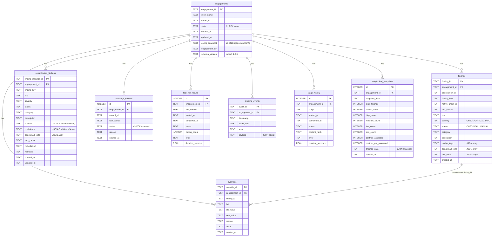
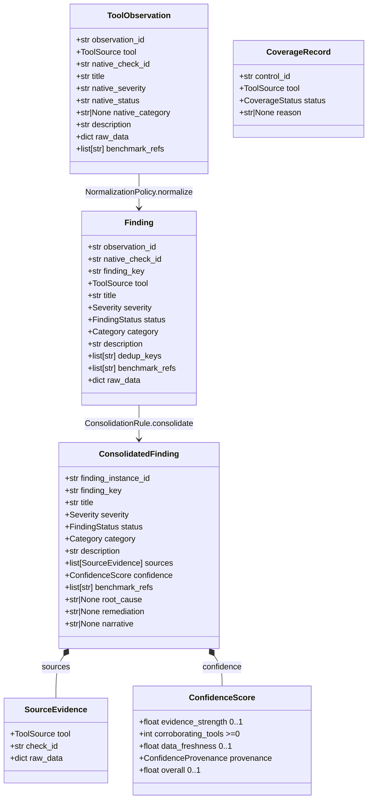

# Public Data Model

This document covers the persisted relational shape (SQLite) and the
in-memory Pydantic models that flow between pipeline stages. For the
Protocol contracts that consume and produce these models see
[extension-points.md](extension-points.md). For pipeline flow see
[pipeline.md](pipeline.md).

## SQLite Schema (Engagement Database)

Schema lives in
[`persistence/migrations/001_initial.sql`](../src/gxassessms/persistence/migrations/001_initial.sql)
with subsequent migrations applied in order
([002_add_native_check_id.sql](../src/gxassessms/persistence/migrations/002_add_native_check_id.sql)).
WAL mode is enabled on every connection; the `_schema_migrations` table
tracks applied files
([`database.py:115-181`](../src/gxassessms/persistence/database.py)).



**Notes on relationships.**

- All child tables reference `engagements(engagement_id)` via SQLite
  `REFERENCES`. The schema does not declare `ON DELETE CASCADE`; the
  `EngagementRepo.delete()` method deletes from each child table explicitly
  in dependency order
  ([`engagement_repo.py:255-286`](../src/gxassessms/persistence/engagement_repo.py)).
- `overrides.finding_id` references finding identity by string; it is not
  declared as a SQL foreign key. The override may target either a parsed
  `findings.finding_id` or a `consolidated_findings.finding_instance_id`,
  depending on the field being overridden.
- `pipeline_events.payload` is always a JSON object string. Event-type
  payload shapes are documented in
  [`pipeline/state.py`](../src/gxassessms/pipeline/state.py) (e.g.
  `RawOutputIngestedPayload`).

### Index strategy

Defined alongside the schema:

| Index | Columns | Use |
|-------|---------|-----|
| `idx_findings_severity_category` | `(severity, category)` | cross-engagement queries |
| `idx_findings_engagement_severity` | `(engagement_id, severity)` | per-engagement filtering |
| `idx_findings_tool_check` | `(tool_source, finding_key)` | adapter analytics |
| `idx_pipeline_events_engagement_timestamp` | `(engagement_id, timestamp)` | journal ordering |
| `idx_pipeline_events_engagement_event_type` | `(engagement_id, event_type)` | event filter |
| `idx_consolidated_findings_engagement` | `(engagement_id)` | per-engagement reports |
| `idx_coverage_records_engagement` | `(engagement_id)` | coverage join |
| `idx_overrides_engagement` | `(engagement_id)` | override export |
| `idx_stage_history_engagement` | `(engagement_id)` | timing analytics |
| `idx_tool_run_results_engagement` | `(engagement_id)` | run metadata |
| `idx_longitudinal_snapshots_engagement_date` | `(engagement_id, snapshot_date)` UNIQUE | trend-tracking snapshots |

## In-Memory Pydantic Models

The pipeline lifts the persisted rows into typed Pydantic models defined in
[`core/domain/models.py`](../src/gxassessms/core/domain/models.py). All
datetime fields are validated as UTC by `ensure_utc()`
([`core/config/datetime_utils.py`](../src/gxassessms/core/config/datetime_utils.py)).

### Three Models for Tool Output

Each adapter run produces three distinct shapes of the same data, each with
a different responsibility and path representation:

| Model | Lifecycle | Path representation |
|-------|-----------|---------------------|
| `CollectionOutput` | Returned by `adapter.collect()` | Platform-native absolute paths |
| `ResolvedManifest` | Built by `confine_and_resolve()` for parse/coverage | Absolute paths, proven inside engagement dir |
| `RawToolOutput` | Persisted to disk for replay | POSIX-relative canonical paths |

`AdapterResult` and `CollectionResult` wrap these with `AdapterRunStatus`
and any error string from a failed adapter run. A `SUCCESS` result must
carry the wrapped output; the model validator enforces this
([`models.py:230-244, 384-398`](../src/gxassessms/core/domain/models.py)).

### Finding Lifecycle



### Identity Model

Three explicit IDs with distinct lifecycles, none of which serve as both
semantic identity and persistence key:

| ID | Scope | Assigned by | Format |
|----|-------|-------------|--------|
| `observation_id` | Parse-time identity | `adapter.parse()` | `{tool}:{native_check_id}` (convention) |
| `finding_key` | Cross-tool semantic identity | `NormalizationPolicy.normalize()` | `{namespace}:{control_id}` (e.g. `cis:m365:5.2.2.1`) |
| `finding_instance_id` | DB instance identity | `FindingRepo.save_consolidated()` | UUID, never reused across engagements |

The constraints `Finding.dedup_keys_must_be_nonempty` and
`ConsolidatedFinding.sources_must_be_nonempty` enforce that every finding
carries at least one dedup key and every consolidated finding cites at least
one source evidence record
([`models.py:128-175`](../src/gxassessms/core/domain/models.py)).

### Engagement and Reporting Models

```mermaid
classDiagram
    class AdapterResult {
        +str adapter_name
        +AdapterRunStatus status
        +ResolvedManifest|None raw_output
        +str|None error
        +float duration_seconds
    }

    class CollectionResult {
        +str adapter_name
        +AdapterRunStatus status
        +CollectionOutput|None collection_output
        +str|None error
        +float duration_seconds
    }

    class ToolRunResult {
        +ToolSource tool
        +datetime started_at
        +datetime completed_at
        +AdapterRunStatus status
        +int finding_count
        +str|None error
    }

    class ReportKeyStats {
        +int total_findings
        +int critical_count
        +int high_count
        +int medium_count
        +int low_count
        +int info_count
        +int tools_run
        +int tools_failed
        +int controls_assessed
        +int controls_not_assessed
    }

    class RemediationPhase {
        +RemediationPhaseName phase
        +str title
        +str description
        +list[str] findings "finding_instance_ids"
        +int priority
    }

    class ReportPayload {
        +str schema_version "default 1.0.0"
        +str engagement_id
        +str tenant_name
        +str assessment_date
        +list[str] tool_sources
        +list[dict] findings
        +list[dict] coverage
        +dict narratives
        +dict metadata
    }

    class AuthContext {
        +SecretStr|None token
        +dict[str,str] credential_refs
        +datetime|None expires_at
        +dict extra
    }
```



`ReportPayload` is the published JSON contract handed to renderers. Its
`schema_version` is the version a renderer declares compatibility with via
`supported_payload_versions` (semver range, e.g. `>=1.0.0,<2.0.0`).
Validation happens in `validate_version_compatibility()` before any renderer
process is launched
([`renderer_registry.py:79-99`](../src/gxassessms/reporting/renderer_registry.py)).

`AuthContext.credential_refs` is validated to contain only lookup
identifiers (env var names or `provider:key` form). Raw secret values are
rejected at model validation time
([`models.py:45-78`](../src/gxassessms/core/domain/models.py)).

## Enumerations

Defined in
[`core/domain/enums.py`](../src/gxassessms/core/domain/enums.py). All are
`StrEnum` for stable JSON serialization.

| Enum | Members |
|------|---------|
| `Severity` | `CRITICAL`, `HIGH`, `MEDIUM`, `LOW`, `INFO` |
| `FindingStatus` | `FAIL`, `PASS`, `WARNING`, `ERROR`, `N/A`, `MANUAL` |
| `Category` | `Identity & Access`, `Data Protection`, `Device Management`, `Email & Collaboration`, `Infrastructure Security`, `Network Security`, `Logging & Monitoring`, `Cost Optimization`, `Operational Excellence`, `Compliance & Governance`, `Application Security` |
| `AdapterRunStatus` | `SUCCESS`, `FAILED`, `SKIPPED`, `TIMEOUT` |
| `CoverageStatus` | `assessed`, `partially_assessed`, `not_assessed` |
| `ToolSource` | `ScubaGear`, `Maester`, `Monkey365`, `M365_Assess`, `Prowler`, `Steampipe`, `SecureScore`, `AzureAdvisor`, `DefenderCloud`, `M365DSC`, `IntuneExport`, `AzureResourceGraph`, `Custom`, `Manual` |
| `EngagementState` | `CREATED`, `COLLECTING`, `COLLECTED`, `PARSING`, `PARSED`, `NORMALIZING`, `NORMALIZED`, `CONSOLIDATING`, `CONSOLIDATED`, `QA_REVIEW`, `QA_APPROVED`, `RENDERING`, `COMPLETE`, `FAILED` |

`EngagementState` also exposes `can_transition_to()`,
`assert_can_transition_to()`, and `is_terminal`. The transition map is a
`MappingProxyType` defined at module scope; new states or transitions
require editing the map directly
([`enums.py:113-152`](../src/gxassessms/core/domain/enums.py)).

## Event Journal Types

`pipeline_events.event_type` is constrained to a literal-typed set
([`state.py:28-45`](../src/gxassessms/pipeline/state.py)):

```
state_transition, override, ai_modification, rerun,
manual_finding_added, lock_broken, stale_recovery,
narrative_edit, narrative_approval, rerender, token_usage,
manual_merge, raw_output_ingested
```

Event payloads are stored as JSON. Known typed payload shapes:

| Event type | Payload shape |
|-----------|---------------|
| `state_transition` | `{from, to, content_hash?}` |
| `override` | `{finding_id, field, new_severity, reason}` |
| `manual_finding_added` | `{finding_key, severity}` |
| `rerun` | `{from_state, to_state, target_stage, reason}` |
| `raw_output_ingested` | `RawOutputIngestedPayload` (see [`state.py:95-103`](../src/gxassessms/pipeline/state.py)) |

The journal is append-only; the orchestrator's `_emit_event()` is the only
caller of `EventRepo.append()` from inside the public package.
