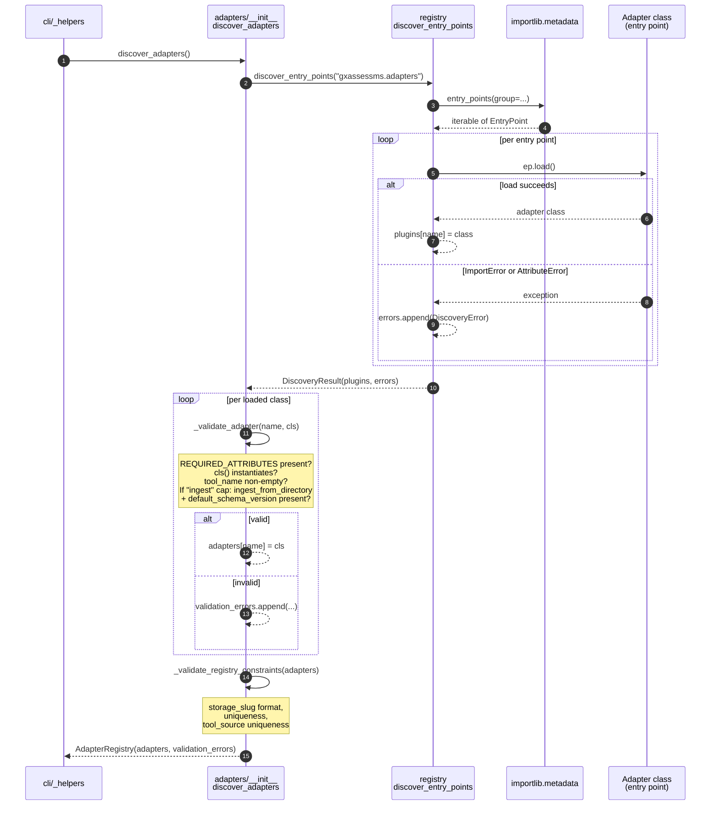
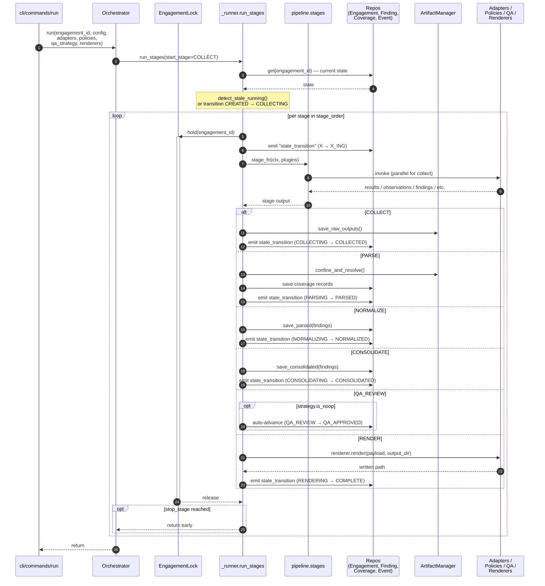
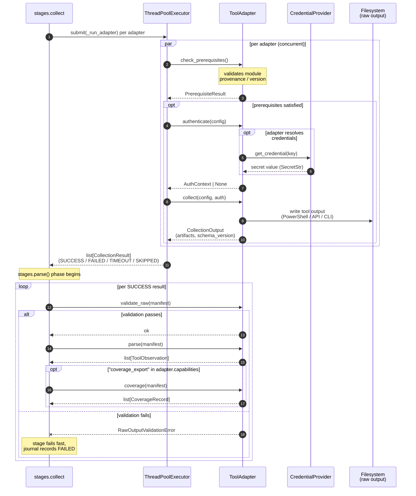
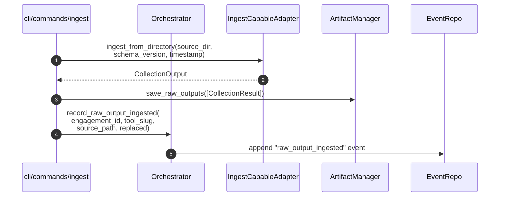
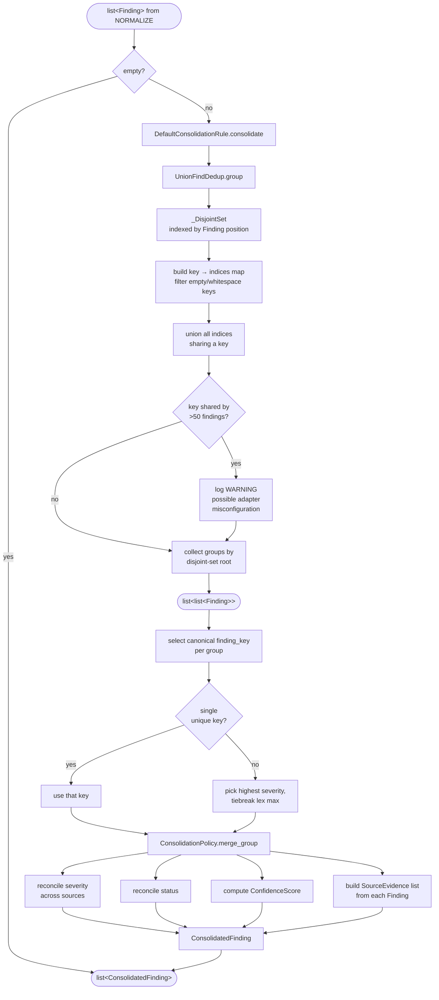

# Pipeline Lifecycle

The pipeline executes six stages -- COLLECT, PARSE, NORMALIZE, CONSOLIDATE,
QA_REVIEW, RENDER -- against a single engagement. Each stage is a pure
function in [`pipeline/stages.py`](../src/gxassessms/pipeline/stages.py); the
`Orchestrator` in [`pipeline/orchestrator.py`](../src/gxassessms/pipeline/orchestrator.py)
calls them through `_runner.run_stages()` and persists results between calls.

This document covers four flows:

1. Plugin discovery and entry-point registration
2. End-to-end orchestrator run
3. Tool-adapter invocation lifecycle inside `COLLECT` and `PARSE`
4. Consolidation pipeline data flow

For state-machine details and resume rules see
[architecture.md](architecture.md#pipeline-lifecycle).

---

## 1. Plugin Discovery and Entry-Point Registration

All extension types follow the same shape: an entry-point group, a generic
discovery pass via [`registry.discover_entry_points()`](../src/gxassessms/registry.py),
and a type-specific validation pass that excludes invalid entries with a
logged warning rather than crashing. The adapter registry adds cross-adapter
constraint checks (duplicate slug / tool_source detection, slug format).

Renderers follow the same pattern via
[`reporting/renderer_registry.py:RendererRegistry.discover()`](../src/gxassessms/reporting/renderer_registry.py).
Renderer instantiation also performs dependency-chain validation:
`NodeRenderer.__init__` checks that `render.js` exists and that Node.js is
on the PATH, raising `RendererDependencyError` if either is missing
([`renderer_registry.py:159-169`](../src/gxassessms/reporting/renderer_registry.py)).

QA strategies, policies, consolidation rules, and credential providers are
discovered the same way through `discover_entry_points()` with their
respective group names (see [architecture.md](architecture.md#extension-points)).

---

## 2. Orchestrator Run Lifecycle

`Orchestrator.run()` and `Orchestrator.run_from()` both delegate to
`_runner.run_stages()`, which walks the stage list starting at a given
stage. Between every stage the runner persists outputs through the
appropriate repository and emits a `state_transition` event to the journal.

Key invariants:

- **Lock scope.** Each stage acquires the lock for its duration; the lock is
  released between stages so a separate process can inspect engagement state.
  ([`_runner.py`](../src/gxassessms/pipeline/_runner.py))
- **Partial collection.** Failed adapters produce a `CollectionResult` with
  status `FAILED`, `TIMEOUT`, or `SKIPPED`; downstream stages skip them and
  log a warning. ([`stages.parse()`](../src/gxassessms/pipeline/stages.py:161-207))
- **Approval freshness for RENDER.** Before entering RENDER, the orchestrator
  walks the journal: if any upstream stage (`COLLECT`, `PARSE`, `NORMALIZE`,
  `CONSOLIDATE`) was re-run after the most recent `QA_APPROVED` event, it
  raises `PipelineError`.
  ([`orchestrator._verify_qa_for_render`](../src/gxassessms/pipeline/orchestrator.py:372-415))
- **Resume.** `determine_resume_stage()` maps the current state to the next
  stage to run. `PARSED -> PARSE` (not `NORMALIZE`) because observations
  aren't persisted; replay re-parses from manifests.
  ([`orchestrator.py:465-514`](../src/gxassessms/pipeline/orchestrator.py))

---

## 3. Tool-Adapter Invocation Lifecycle

Each adapter goes through a fixed sequence inside `COLLECT` and `PARSE`. The
orchestrator never calls adapter methods out of order.

`CollectionOutput` carries platform-native absolute paths. Before the parse
stage runs, `confine_and_resolve()` rewrites those paths into
`ResolvedManifest` instances whose `file_manifest` entries are absolute paths
proven to live inside the engagement directory. Manifests that fail
confinement raise `ManifestConfinementError`.

### Optional: Operator Ingest

An adapter that declares `"ingest"` in its capability set and implements the
`IngestCapableAdapter` Protocol can also be fed pre-collected output via
`mseco ingest`:

After ingest, the operator runs `mseco replay <engagement_id>` to re-enter
the pipeline at PARSE.

---

## 4. Consolidation Pipeline Data Flow

CONSOLIDATE deduplicates findings across tools. The default implementation
splits the work between a tool-agnostic union-find dedup engine and a
policy-driven merge step.

Highlights:

- **Union-find with iterative path compression.** No recursion -- safe for
  deep dedup chains.
  ([`dedup.py:38-47`](../src/gxassessms/consolidation/dedup.py))
- **Whitespace filtering.** Empty or whitespace-only dedup keys are
  filtered out before grouping. A finding with no valid key remaining gets
  its own isolated group and a WARNING log line.
- **Cardinality warning.** If a single key joins more than 50 findings, the
  engine logs a warning -- usually a sign that an adapter is using too
  generic a `finding_key` rule.
- **Canonical key selection.** Within a group, the policy picks one
  `finding_key` to represent the merged finding. The default rule prefers
  the key from the highest-severity contributor and breaks ties
  lexicographically for determinism.
  ([`rules.py:93-119`](../src/gxassessms/consolidation/rules.py))

The dedup engine has no knowledge of `ConsolidationPolicy`; the policy has
no knowledge of how groups are formed. The bridge sits only in
`DefaultConsolidationRule`. Either piece can be replaced via the
`gxassessms.consolidation_rules` and `gxassessms.policies` entry-point groups.

## See also

- [extension-points.md](extension-points.md) -- full Protocol method
  signatures
- [data-model.md](data-model.md) -- ER diagram for the persisted state
- [configuration.md](configuration.md) -- engagement YAML reference
- [runbook.md](runbook.md) -- partial-failure triage and resume scenarios
