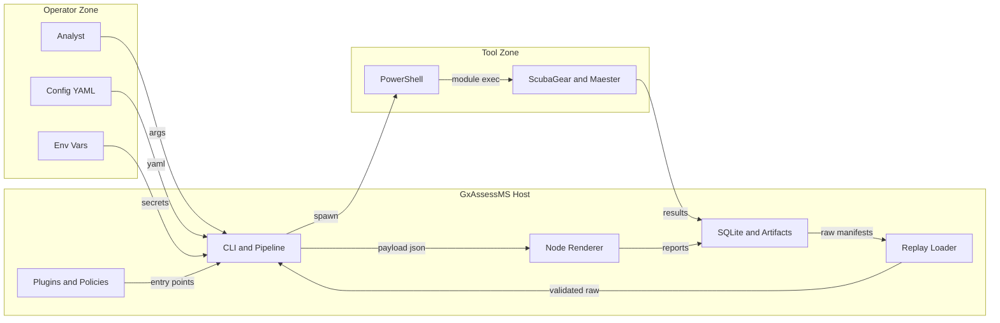

## Executive summary
GxAssessMS is a local assessment orchestrator, not an internet-facing service. The dominant risks are local trust-boundary failures where untrusted code or tampered artifacts cross into a high-privilege analyst process: PowerShell module execution for external assessment tools, Python and Node plugin loading via entry points, replay ingestion of filesystem artifacts, and storage of customer-sensitive results in default local directories. Availability and destructive lifecycle actions matter too, especially when the tool runs on shared runners or servers instead of a dedicated analyst workstation.

## Scope and assumptions
- In-scope paths:
  `src/gxassessms/cli`, `src/gxassessms/core`, `src/gxassessms/pipeline`, `src/gxassessms/persistence`, `src/gxassessms/adapters`, `src/gxassessms/reporting`, `src/gxassessms/registry.py`, and `report-renderers/basic`.
- Out-of-scope:
  external assessment tool internals (`ScubaGear`, `Maester`), private `gxassessms-guardantix` review/analytics code that does not yet exist in this repo, tests/fixtures except where they confirm intended controls, and general host hardening outside this codebase.
- Explicit assumptions:
  this repo is used from a local CLI (`mseco`) rather than an HTTP service, customer engagement artifacts are customer-sensitive, deployments may be either single-user analyst workstations or shared servers/runners, and attackers do not start with root or arbitrary code execution on the host.
- Open questions that still affect ranking:
  whether production deployments will pin and verify approved PowerShell/Python/Node packages before execution, and whether shared-server deployments will use a dedicated service account plus encrypted or permission-hardened storage.

## System model
### Primary components
- `Click` CLI entrypoints dispatch assessment and lifecycle commands from `src/gxassessms/cli/main.py` and `src/gxassessms/cli/commands/*.py`.
- Config loading reads operator-supplied YAML, parses it with `yaml.safe_load`, and validates it with Pydantic in `src/gxassessms/core/config/config.py::load_config`.
- Adapter execution runs external PowerShell modules through `src/gxassessms/adapters/_base.py::run_powershell`, with concrete collectors in `src/gxassessms/adapters/scubagear/adapter.py` and `src/gxassessms/adapters/maester/adapter.py`.
- Pipeline orchestration, replay, normalization, consolidation, QA, and rendering are coordinated in `src/gxassessms/pipeline/orchestrator.py`, `src/gxassessms/pipeline/_runner.py`, `src/gxassessms/pipeline/replay.py`, and `src/gxassessms/pipeline/stages.py`.
- Persistence stores engagement metadata, findings, coverage, and events in SQLite plus raw artifacts and reports on disk under the default data root from `src/gxassessms/persistence/database.py::get_default_data_dir` and `src/gxassessms/persistence/artifacts.py`.
- Report generation crosses a second process boundary into Node.js through `src/gxassessms/reporting/renderer_registry.py::NodeRenderer.render`, using the bundled renderer in `report-renderers/basic/render.js`.
- Plugin discovery loads adapters, renderers, policies, and QA strategies through Python entry points in `src/gxassessms/registry.py::discover_entry_points` and helper wrappers in `src/gxassessms/cli/_helpers.py`.

### Data flows and trust boundaries
- Analyst -> CLI and config loader
  Data: command arguments, engagement IDs, config file paths.
  Channel: local process arguments and local file read.
  Guarantees: `click.Path(exists=True, dir_okay=False)` is used on most config-taking commands in `src/gxassessms/cli/commands/run.py`, `preflight.py`, `report.py`, and `consolidate.py`.
  Validation: YAML is parsed with `yaml.safe_load`; unknown keys and bad types are rejected by Pydantic in `src/gxassessms/core/config/config.py`.
- Config YAML -> pipeline runtime
  Data: tenant identifiers, tool enablement, output directories, timeouts, report settings, plugin selection.
  Channel: filesystem file read into Python objects.
  Guarantees: structural validation, extra key rejection, integer and boolean validators.
  Validation: `load_config()` and `validate_config()` reject malformed structure, but they do not enforce trusted provenance or path confinement for operator-selected directories.
- Environment variables -> credential boundary
  Data: client secret values and auth references.
  Channel: OS environment through `os.environ`.
  Guarantees: no secret is stored in the YAML file by default design (`src/gxassessms/core/contracts/credentials.py`).
  Validation: existence checks only; no secret manager integration, rotation checks, or OS permission checks in repo code.
- CLI and pipeline -> Python plugin entry points
  Data: executable code objects for adapters, renderers, policies, and QA strategies.
  Channel: `importlib.metadata.entry_points()` and `ep.load()` in `src/gxassessms/registry.py`.
  Guarantees: basic adapter attribute validation in `src/gxassessms/adapters/__init__.py`.
  Validation: no allowlist, signature verification, or sandboxing for loaded plugins.
- Pipeline -> PowerShell -> ScubaGear or Maester
  Data: output directories, selected modules, extra args, and operator environment context.
  Channel: local subprocess invocation with `subprocess.run(..., shell=False)` in `src/gxassessms/adapters/_base.py`.
  Guarantees: PowerShell extra args are allowlisted and ScubaGear module names are canonicalized and validated in `src/gxassessms/adapters/scubagear/adapter.py`.
  Validation: timeout enforcement and non-zero exit handling exist, but module version, publisher, and module path provenance are not checked.
- External tools -> raw artifact storage
  Data: JSON result files plus serialized `RawToolOutput` manifests and copied artifact files.
  Channel: filesystem writes into engagement artifact directories via `ArtifactManager.save_raw_outputs` using generation-staged writes (validate, stage, commit, return).
  Guarantees: path traversal checks in `src/gxassessms/persistence/artifacts.py::_validate_path_within_root`; source hash verification pre-copy; copy integrity verification post-copy; canonical POSIX path validation on all target relpaths; generation-staged commit with fail-closed semantics.
  Validation: adapter-specific raw-output validators check expected JSON shape before parsing. SHA-256 content hashes are recorded at collection time and verified during replay via `confine_and_resolve()`.
- Filesystem artifacts -> replay boundary
  Data: `raw-output/manifests/*.json` manifests and referenced result files under `raw-output/artifacts/<tool_slug>/`.
  Channel: local file reads in `src/gxassessms/pipeline/replay.py::load_raw_outputs`, then confinement and integrity verification in `src/gxassessms/pipeline/confinement.py::confine_and_resolve`.
  Guarantees: `RawToolOutput.model_validate_json()` enforces schema shape; `confine_and_resolve()` performs 9 sequential security checks: manifest version gate, three-way slug check, canonical path format, tool-slug path confinement, strict resolve (file must exist), tool-subtree containment (rejects symlink escape), file type check, SHA-256 integrity verification, and duplicate resolution detection.
  Validation: all manifest paths are confined to `raw-output/artifacts/<tool_slug>/` subtree; symlinked artifacts root is rejected; adapters run `validate_raw()` only after confinement passes.
- Pipeline -> Node renderer
  Data: full `ReportPayload`, coverage data, and config snapshot metadata.
  Channel: temp JSON files plus `node render.js` subprocess in `src/gxassessms/reporting/renderer_registry.py`.
  Guarantees: schema-version compatibility checks, renderer timeout, non-empty output enforcement.
  Validation: no sandboxing or renderer allowlist beyond local package discovery and existence checks.
- Lifecycle commands -> artifact and database storage
  Data: archive, restore, purge, and export requests for existing engagements.
  Channel: local CLI commands to filesystem and SQLite.
  Guarantees: `--confirm` is required for purge in `src/gxassessms/cli/commands/engagement.py`; restore extracts with `tarfile.extractall(..., filter="data")`; purge writes an audit manifest first.
  Validation: there is no application-level authz or role separation, so local OS account control is the real security boundary.

#### Diagram

## Assets and security objectives
| Asset | Why it matters | Security objective (C/I/A) |
| --- | --- | --- |
| Raw tool outputs in engagement directories and archives | They contain tenant-specific assessment results and supporting evidence. | C, I |
| Consolidated findings and rendered reports | They drive customer-facing conclusions and remediation decisions. | C, I, A |
| SQLite engagement database and event journal | It is the canonical record for engagement state, overrides, and analytics inputs. | C, I, A |
| Installed PowerShell modules, Python plugins, and Node renderers | Compromise here becomes code execution inside a trusted workflow. | I, A |
| Environment credentials and auth context | They can enable downstream tenant access or lateral investigation if mishandled. | C, I |
| Engagement config snapshots and metadata | They bind a report to a specific tenant, tool set, and execution context. | C, I |
| Analyst workstation or shared runner resources | Pipeline delays or crashes directly block assessments and report delivery. | A |

## Attacker model
### Capabilities
- A local low-privilege user or co-tenant process on a shared host can try to read or modify `~/.gxassessms`, current-working-directory reports, or installed packages.
- A malicious package maintainer or compromised internal package repository can ship a Python entry point, Node renderer, or PowerShell module that GxAssessMS executes.
- A user who can edit engagement artifacts before replay can tamper with raw manifests or replace result files.
- A tenant operator can potentially influence the size and content of assessment output returned by external tools, especially for availability-oriented attacks.

### Non-capabilities
- There is no repo evidence of a network listener, HTTP API, or remote pre-auth request path; remote web exploitation is not a primary threat here.
- This model does not assume attackers already have root/admin on the host; if they do, most repo-level controls become irrelevant.
- This model does not treat the out-of-scope private review/analytics package as present.

## Entry points and attack surfaces
| Surface | How reached | Trust boundary | Notes | Evidence (repo path / symbol) |
| --- | --- | --- | --- | --- |
| `mseco run` and `mseco collect` flow | Operator invokes CLI with config path | Analyst -> CLI | Starts collection, replay-safe persistence, plugin discovery, and renderer loading. | `src/gxassessms/cli/commands/run.py::run_cmd`, `src/gxassessms/pipeline/_runner.py::run_stages` |
| Config YAML loading | Any command that takes `config_path` | Filesystem -> trusted config object | YAML content controls tool enablement, output dirs, timeouts, and report settings. | `src/gxassessms/core/config/config.py::load_config` |
| Environment credential lookup | Preflight and runtime auth | OS env -> trusted process | Secrets are not stored in config, but the repo trusts environment custody. | `src/gxassessms/core/contracts/credentials.py::EnvVarProvider`, `src/gxassessms/cli/commands/preflight.py::_check_auth` |
| Python plugin discovery | Normal CLI startup and helper paths | Installed packages -> code execution | Entry points are loaded dynamically and instantiated with minimal trust controls. | `src/gxassessms/registry.py::discover_entry_points`, `src/gxassessms/cli/_helpers.py::discover_plugin` |
| PowerShell subprocess boundary | Enabled adapters during collect and preflight | Python process -> PowerShell modules | External tools run with the analyst account and host environment. | `src/gxassessms/adapters/_base.py::run_powershell`, `src/gxassessms/adapters/scubagear/adapter.py::collect`, `src/gxassessms/adapters/maester/adapter.py::collect` |
| Raw artifact persistence | Successful collection stage | External tool outputs -> engagement storage | Results are serialized for replay and later reporting. | `src/gxassessms/persistence/artifacts.py::save_raw_outputs` |
| Replay manifests and referenced files | `mseco replay` or `run_from(PARSE)` | Filesystem artifacts -> parser | All replay paths pass through `confine_and_resolve()` before any adapter method runs. | `src/gxassessms/pipeline/replay.py::load_raw_outputs`, `src/gxassessms/pipeline/confinement.py::confine_and_resolve`, `src/gxassessms/pipeline/_runner.py::_rehydrate_upstream_state` |
| Node renderer subprocess | Render stage and report command | Python process -> Node package | Full findings and config snapshot metadata cross into a second runtime. | `src/gxassessms/reporting/renderer_registry.py::NodeRenderer.render`, `src/gxassessms/reporting/payload.py::assemble_payload` |
| Engagement lifecycle commands | `mseco engagement archive|restore|purge|export` | Operator -> destructive storage actions | Affects artifact custody, deletion, and metadata disclosure. | `src/gxassessms/cli/commands/engagement.py` |

## Top abuse paths
1. Attacker goal: execute code in the trusted assessment workflow. Steps: replace or poison a PowerShell module used by ScubaGear or Maester -> analyst runs `mseco run` or `mseco preflight` -> malicious module executes with analyst privileges and accesses local artifacts or outbound network -> customer data is exfiltrated or findings are silently altered.
2. Attacker goal: gain code execution through a repo-supported extension path. Steps: install a rogue Python entry-point package or modify a renderer package -> helper discovery auto-loads it or render stage invokes it -> malicious code reads findings and config snapshot data -> report output and local data integrity are lost.
3. Attacker goal: falsify a report or read unintended JSON content. Steps: modify `raw-output/manifests/*.json` replay manifests to point at another file or another engagement's results -> operator runs `mseco replay` or `consolidate --reparse` -> `confine_and_resolve()` rejects out-of-subtree paths and SHA-256 mismatches. **Partially mitigated** by PR #47: path confinement, tool-subtree containment, and content hash verification now block path traversal, cross-tool escape, and artifact drift. Residual risk: an attacker who modifies both the manifest and the referenced artifact consistently (matching hashes) is not detected; this requires an external trust root (see design spec security scope).
4. Attacker goal: collect customer-sensitive artifacts from a shared host. Steps: read `~/.gxassessms/engagements`, archives, SQLite DB, or the default `output/` report directory -> extract raw outputs, findings, and reports -> customer confidentiality is breached without touching tenant-side controls.
5. Attacker goal: deny service or delay report delivery. Steps: cause very large raw output files or place oversized manifests/results in the engagement directory -> replay or rendering reads them fully into memory and writes large temp files -> process times out or exhausts memory/disk.
6. Attacker goal: destroy or disrupt stored engagement data. Steps: use CLI access on a shared host to run `mseco engagement purge <id> --confirm` or repeatedly archive/restore existing engagements -> raw artifacts and DB state are removed or churned -> only audit traces remain and delivery is delayed.

## Threat model table
| Threat ID | Threat source | Prerequisites | Threat action | Impact | Impacted assets | Existing controls (evidence) | Gaps | Recommended mitigations | Detection ideas | Likelihood | Impact severity | Priority |
| --- | --- | --- | --- | --- | --- | --- | --- | --- | --- | --- | --- | --- |
| TM-001 | Compromised or malicious PowerShell module, module-path hijack, or untrusted tool installation source | Attacker can install or replace a module resolved by PowerShell on the analyst host. This is realistic on shared hosts or weakly controlled workstations. | GxAssessMS imports and executes `ScubaGear` or `Maester` through `run_powershell()`, giving the module trusted local execution. | Local code execution, report tampering, and exfiltration of customer-sensitive artifacts or environment credentials. | Installed tools, host integrity, raw findings, reports, credentials | `shell=False`, PowerShell arg allowlist, ScubaGear module-name validation, and per-run timeouts reduce straight command injection risk. Evidence: `src/gxassessms/adapters/_base.py::run_powershell`, `src/gxassessms/adapters/scubagear/adapter.py::collect`. | No module publisher verification, version pinning, or isolated runtime. Prerequisite checks only verify module presence. | Pin approved module versions and hashes, verify module signature/publisher before execution, and run collectors in a dedicated low-privilege account or container with constrained outbound access. | Log module version, install path, and PowerShell executable path per run; alert on unsigned or unexpected module changes. | Medium | High | high |
| TM-002 | Malicious Python entry-point package or modified Node renderer package | Attacker can install or alter a package that exposes `gxassessms.adapters`, `gxassessms.renderers`, `gxassessms.policies`, or related entry points. | `discover_entry_points()` loads plugin code and helpers instantiate it; render stage runs `node render.js` on full payload data. | Arbitrary code execution, customer data theft, and silent report integrity loss. | Findings, reports, config snapshots, host integrity | Adapter validation checks required attributes; renderer code checks `render.js` existence, Node availability, payload version, and timeout. Evidence: `src/gxassessms/adapters/__init__.py`, `src/gxassessms/reporting/renderer_registry.py`. | No package allowlist, signature verification, runtime sandbox, or option to disable third-party plugins by default. | Add an explicit allowlist for approved entry points and packages, verify hashes for renderer directories and lockfiles, support a "trusted plugins only" mode, and isolate renderer execution from the main process. | Emit loaded plugin name, version, and file path at startup; alert when an unexpected plugin group member appears. | Medium | High | high |
| TM-003 | Local user or process tampering with persisted replay manifests or referenced result files | Attacker can modify `raw-output/manifests/*.json` or files under `raw-output/artifacts/` before replay. | Replay loads the manifest and `confine_and_resolve()` enforces path confinement and SHA-256 integrity before any adapter method runs. | False findings or cross-engagement contamination if attacker consistently replaces both manifest and artifact (bypassing hash check). Limited to within-subtree substitution. | Report integrity, engagement isolation, customer data confidentiality | `confine_and_resolve()` performs 9 sequential checks: manifest version gate, three-way slug match (filename/field/adapter), canonical POSIX path format, tool-slug path prefix, strict resolve (must exist), tool-subtree containment (rejects cross-tool symlinks), regular file check, SHA-256 content hash verification, duplicate resolution detection. Symlinked artifacts root rejected before per-path checks. Manifests use only POSIX-relative paths; adapters validated by `validate_raw()` only after confinement. Evidence: `src/gxassessms/pipeline/confinement.py::confine_and_resolve`, `src/gxassessms/core/domain/path_validation.py::validate_canonical_posix_path`, `src/gxassessms/core/hashing.py::sha256_file`, `src/gxassessms/pipeline/replay.py::load_raw_outputs`. | No external trust root (signatures, HMAC, or separate digest store). An attacker with write access who replaces both manifest and referenced artifact with matching SHA-256 hashes will not be detected. | Add external trust root: HMAC or digital signature over manifests, or store digests in a separate protected location. | Log every replay path read and hash verification result; alert on confinement failures. | Low (reduced from Medium by confinement controls) | High | medium (reduced from high) |
| TM-004 | Shared-host co-tenant, local malware, or broadly readable backups/filesystems | Host is shared, or filesystem permissions/backups allow other users or processes to read engagement storage. | Sensitive artifacts are read from the default data root, SQLite DB, archives, or default output directory. | Confidentiality breach of customer-sensitive assessment results and metadata. | Raw outputs, reports, SQLite DB, config snapshots, event journal | The repo separates engagements into dedicated directories and keeps an event journal; file locks protect integrity against concurrent mutation. Evidence: `src/gxassessms/persistence/database.py::get_default_data_dir`, `src/gxassessms/persistence/artifacts.py`, `src/gxassessms/pipeline/state.py::EngagementLock`. | No explicit permission hardening, encryption, secure-output default, or warning when directories are group/world readable. | Enforce `0700` on data and report directories, require dedicated service accounts on shared hosts, document encrypted-disk requirements, and consider optional artifact encryption for stored findings and reports. | Check and warn on broad directory permissions or storage roots on shared mounts; log report output locations. | Medium | High | high |
| TM-005 | Malicious tenant operator or local attacker supplying oversized or malformed artifacts | Attacker can influence external tool output size or place large replay files on disk. | The pipeline reads whole files with `read_text()` and `json.loads()`, assembles full report payloads, and renders full document buffers. | Memory, disk, or timeout exhaustion delays assessments and can crash the runner. | Host availability, job completion, report delivery | Collection and rendering timeouts exist, and replay/adapter validators fail on obvious malformed structure. Evidence: `src/gxassessms/adapters/_base.py::load_json_file`, `src/gxassessms/reporting/renderer_registry.py::NodeRenderer.render`, `src/gxassessms/pipeline/replay.py`. | No file-size caps, finding-count ceilings, disk-space checks, or streaming parsers. | Enforce max artifact sizes and finding counts, reject unusually large payloads before render, add disk-space preflight checks, and stream parse where practical. | Log file sizes, finding counts, and renderer payload size; alert on repeated size-limit hits or render timeouts. | Medium | Medium | medium |
| TM-006 | Insider or shared-host user with CLI access | Attacker can execute `mseco engagement archive|restore|purge|export` against known engagement IDs. | Lifecycle commands delete or churn artifacts and DB rows, or export metadata, using the caller's OS privileges. | Data loss, operational disruption, and limited metadata disclosure. | Artifact availability, engagement DB, customer delivery timelines | Purge requires `--confirm`, writes an audit manifest first, and restore uses a staging directory plus `tar` data filtering. Evidence: `src/gxassessms/cli/commands/engagement.py`, `src/gxassessms/persistence/artifacts.py::purge`, `src/gxassessms/persistence/artifacts.py::restore`. | No application-level authorization, role separation, immutable backup policy, or host-level guardrails around destructive commands. | Restrict CLI access to a dedicated account, require OS-level RBAC or `sudo` for purge/archive on shared hosts, and back the store with immutable snapshots or backup policy. | Record lifecycle actions with actor, host, and engagement ID; alert on purge or repeated archive/restore outside maintenance windows. | Medium | Medium | medium |

## Criticality calibration
- `critical`
  For this repo, critical means a low-friction path to host compromise or broad exfiltration/tampering across multiple customer engagements from a routine workflow.
  Examples: a widely deployed unsigned PowerShell module compromise that executes during every collection run; a trusted-by-default renderer or plugin package that auto-loads across environments and steals all findings.
- `high`
  High means compromise of one engagement's customer-sensitive artifacts or material integrity loss in customer-facing reports, without needing root or implausible preconditions.
  Examples: replay manifest tampering that causes cross-engagement data mix-up; shared-host read access to `~/.gxassessms` or default `output/`; a malicious adapter package that runs only when that adapter is enabled.
- `medium`
  Medium means meaningful availability or destructive risk that generally requires local access, deployment misconfiguration, or large attacker-influenced inputs.
  Examples: oversized replay artifacts causing render failures; shared-host misuse of purge or archive commands; restore-time failures from tampered archives that block re-analysis.
- `low`
  Low means fail-closed behavior or issues that mostly require operator self-harm and do not provide realistic attacker leverage in the intended deployment model.
  Examples: malformed YAML rejected by `load_config()`; invalid PowerShell `extra_args` rejected by the allowlist; missing PowerShell modules causing preflight failure instead of insecure fallback behavior.

## Focus paths for security review
| Path | Why it matters | Related Threat IDs |
| --- | --- | --- |
| `src/gxassessms/adapters/_base.py` | Core subprocess and JSON-loading boundary for external PowerShell tools; this is where code execution and file ingestion start. | TM-001, TM-005 |
| `src/gxassessms/adapters/scubagear/adapter.py` | Builds PowerShell command lines, records raw output manifests, and trusts output directories and module selections. | TM-001, TM-003 |
| `src/gxassessms/adapters/maester/adapter.py` | Same boundary as ScubaGear, with dynamic output discovery and replay-sensitive JSON selection. | TM-001, TM-003 |
| `src/gxassessms/registry.py` | Central plugin loading mechanism for entry-point based code execution. | TM-002 |
| `src/gxassessms/cli/_helpers.py` | Instantiates discovered adapters, renderers, and policies, making discovery risks operational. | TM-002 |
| `src/gxassessms/reporting/renderer_registry.py` | Crosses into Node.js, writes temp payload files, and trusts renderer packages to process full report data. | TM-002, TM-005 |
| `src/gxassessms/reporting/payload.py` | Assembles the exact data handed to renderers, including findings and config snapshot metadata. | TM-002, TM-004 |
| `report-renderers/basic/render.js` | Concrete renderer process that writes report output and demonstrates the current Node trust boundary. | TM-002, TM-005 |
| `src/gxassessms/pipeline/confinement.py` | Single trust boundary for all replay security enforcement: 9 sequential checks including path confinement, symlink detection, and SHA-256 verification. | TM-003 |
| `src/gxassessms/core/domain/path_validation.py` | Shared POSIX path validation helper used by both RawToolOutput model validators and `confine_and_resolve()`. | TM-003 |
| `src/gxassessms/core/hashing.py` | Shared SHA-256 file hashing utility used across collection, persistence, and confinement stages. | TM-003 |
| `src/gxassessms/pipeline/replay.py` | Replay loader reads manifests from `raw-output/manifests/` and validates directory shape before deserialization. All loaded manifests pass through `confine_and_resolve()` before adapter methods run. | TM-003, TM-005 |
| `src/gxassessms/persistence/artifacts.py` | Governs artifact storage with generation-staged writes, archive/restore/purge, path-traversal checks, and source/copy hash verification. | TM-003, TM-004, TM-006 |
| `src/gxassessms/persistence/database.py` | Defines default storage location and database initialization behavior for sensitive engagement state. | TM-004 |
| `src/gxassessms/cli/commands/engagement.py` | Exposes destructive and export-oriented lifecycle surfaces directly to operators. | TM-006 |

Quality check:
- Covered runtime entry points discovered in repo: run, preflight, replay, report, adapter discovery, and engagement lifecycle commands.
- Mapped each major trust boundary at least once in threats: plugin loading, PowerShell execution, replay/filesystem artifacts, Node rendering, data-at-rest, and destructive lifecycle operations.
- Kept runtime behavior separate from out-of-scope private review/analytics code and from tests.
- Reflected user clarifications: deployments may be dedicated or shared, private package is out of scope, and artifacts are customer-sensitive.
- Remaining assumptions are explicit: package provenance and OS-level storage hardening are not enforced by repo code.
